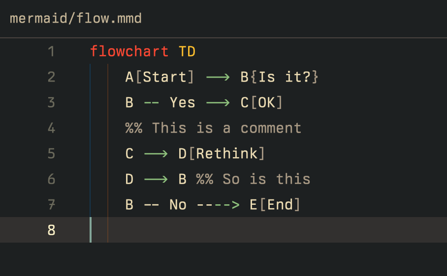

# Mermaid for Zed

An extension that adds Mermaid support for Zed.

Learn more about Mermaid at <https://mermaid.js.org>

## Installation

1. Open the Zed Extension Gallery by: 
  a. pressing `cmd-shift-x` (macOS) 
  b. or pressing `ctrl-shift-x` (Linux) 
  c. or triggering the `zed: extensions` command from the command pallet 
  d. or by selecting `"Zed > Extensions"` from the menu bar
2. Search for `"Mermaid"`.
3. Click `"Install"`.

## Acknowledgments

- Tree-sitter grammar by monaqa: [tree-sitter-mermaid](https://github.com/monaqa/tree-sitter-mermaid)
